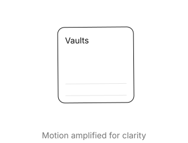
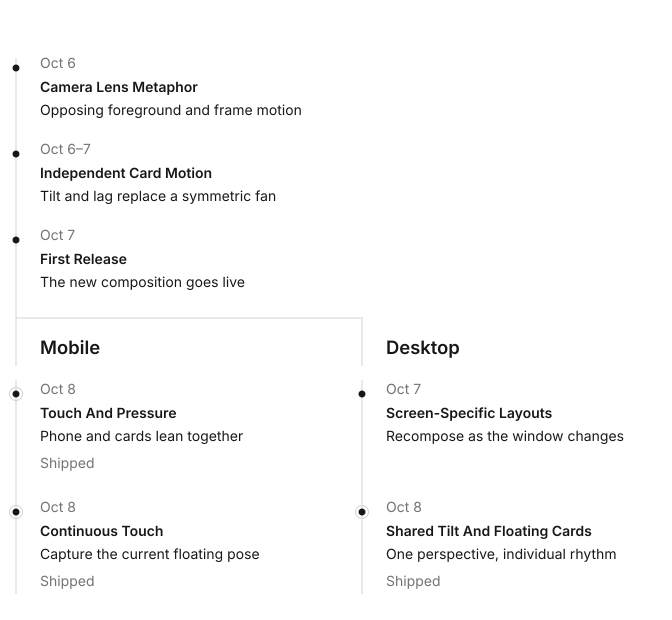

# numz: Landing Motion

We set out to turn the new numz design into an interactive landing page while keeping its composition intact. Desktop and mobile offer different ways to steer the same scene. The camera lens metaphor puts numz in focus and lets interaction change the view.

## Touch Has Weight

On mobile, the scene has a sense of weight. A swipe acts like pressure at its edge, making the phone and cards lean together. At the center, they return to balance. Moving a card moves the composition with it.

Touch takes over from the card's current position and tilt. Its drift resumes smoothly when you let go.

## Shared Perspective

On desktop, the whole scene tilts together. The phone and cards share a perspective, with depth shaping how far each moves. Each card keeps its own rhythm as it drifts.

## Independent Drift

The cards keep drifting without touch. Each follows its own smooth, irregular path, while the shared tilt keeps them in the same space.

## From Sketch To Release

